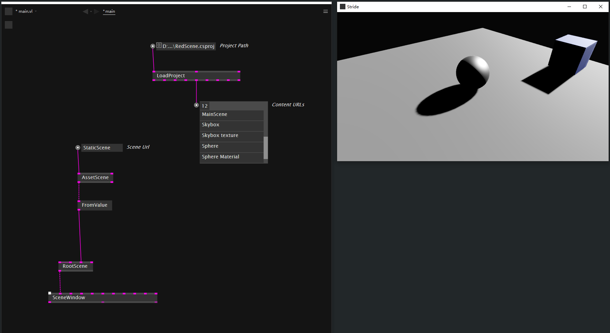
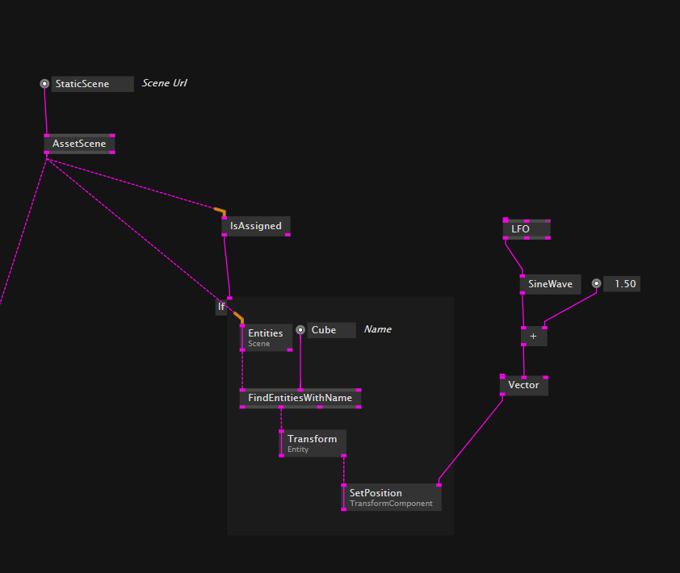

# 如何将Stride场景引入

## 关于Stride的tips

- 新建项目时候，记得选择``DX11 OpenGL ES 3.1``
- Scene 也是 Asset
- 读取你的core场景文件的``csproj``文件。路径可能是``projectname/projectname/projectname.csproj``
- RootScene节点有个隐藏的pin，叫做Child Scene，需要右键Configuration，然后显示出来
- 然后用AssetScene节点，写入Url的名字，连入ChildScene pin，就引入了这个场景其实

- 尝试一下在Stride game Editor里面添加删除一些asset，就能感受到同步的更新

# 用程序控制场景中的物体

- 所有的物体都是以Entity存在的，所有我们就可以通过一些列的节点找到某些Entity
- Entity(Stride.API.Engine.Scene) FindEntitiesWithName
- 找到Entity就可以用控制Entity的节点来控制它

# 导出场景时，对asset的管理

- 为了能够在编写patch的时候，以及在完成之后导出application的时候，依旧可以找到正确的素材路径，我们可以使用ApplicationPath节点，再拼接上相对路径完成。在导出的应用里面也得按照相同的路径放上素材即可。