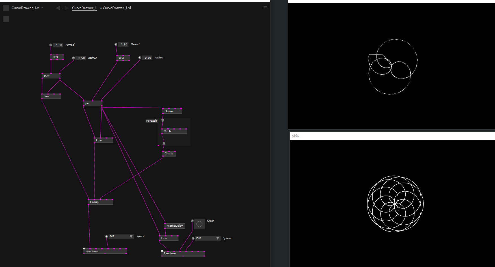

# 几何花纹

小时候玩过一种画画的工具叫做[万花尺](https://zh.wikipedia.org/wiki/%E8%90%AC%E8%8A%B1%E5%B0%BA)，大致可以抽象成两个连杆按照自己的角速度旋转的模型。

今天的例子就想做一个这样的可以画出几何花纹的工具。

重要节点**Line**, **FromPolar**, **FrameDelay**以及Render不刷新的功能